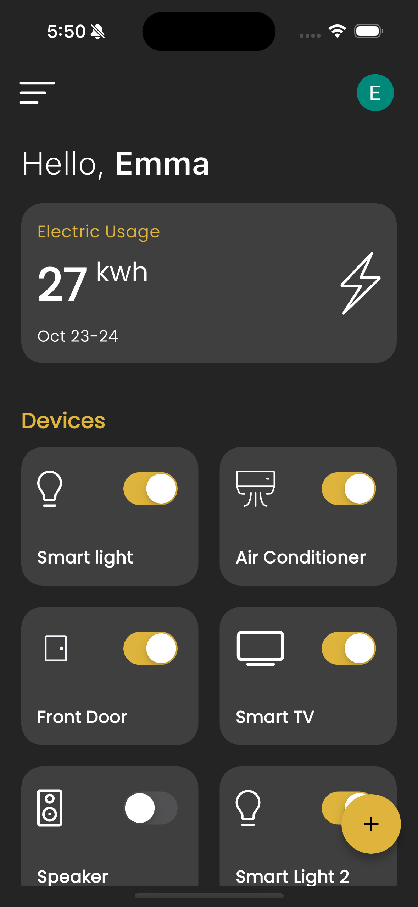

# HomeWave 

A smart home mobile app.

# Project Overview

This GitHub repository hosts a comprehensive smart home mobile application built using the Flutter framework and powered by Firebase. This project allows users to create, manage, control, and track electric usage of smart home devices through a user-friendly mobile app. The key components of this project include user authentication via Google Sign-In and an ESP32 controller configured to connect to Firebase. The app communicates with the ESP32 controller, which manages and monitors connected devices by listening to real-time database changes and tracks electric usage.

# Features

## User Authentication

The application supports user authentication through Google Sign-In, providing a secure and personalized experience for users.

## Real-time Device Management

The heart of this project is the ESP32 controller, which connects to Firebase via Wi-Fi. Users can easily connect smart devices, such as smart lights, to the ESP32. The ESP32 controller continuously monitors the Firebase real-time database for changes, enabling instant updates and control of connected devices.

## Electric Usage Tracking:

The application includes the ability to track the electric usage of connected devices. It records and displays energy consumption data, helping users make informed decisions to optimize energy efficiency in their smart homes.

## Device Control

The mobile app enables users to control smart devices indirectly by altering values in the Firebase real-time database. This approach offers a seamless and intuitive way to interact with and manage connected devices within your smart home.

# Getting Started

To get started with this project, follow these steps:

Clone this repository to your local machine.

Set up your Firebase project and configure the Firebase credentials in the app. Make sure to enable Google Sign-In for authentication.

Upload the Firebase configuration file to your ESP32 controller for integration.

Configure ESP32 with the code provided. Replace the credential with your Wi-Fi network and Firebase project.

Connect smart devices, such as smart lights, to the ESP32 controller.

Build and run the Flutter app on your mobile device or emulator.

Sign in with your Google account and start controlling and tracking the electric usage of your smart devices through the app.
